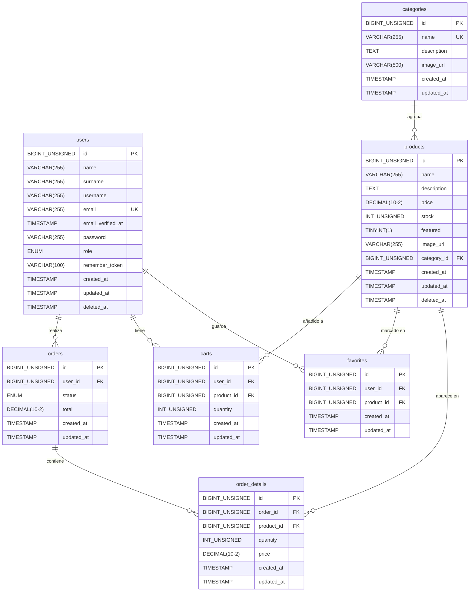

# GeekZone — Diagrama Entidad-Relación

> Renderizable en: GitHub, VS Code (extensión Mermaid), [mermaid.live](https://mermaid.live)

## Descripción de relaciones

| Relación | Cardinalidad | Descripción |
|----------|-------------|-------------|
| Category → Product | 1..N | Una categoría agrupa muchos productos |
| User → Order | 1..N | Un usuario puede tener muchos pedidos |
| User → Cart | 1..N | Un usuario puede tener ítems en el carrito (UNIQUE user+product) |
| User → Favorite | 1..N | Un usuario puede tener muchos favoritos (UNIQUE user+product) |
| Order → OrderDetail | 1..N | Un pedido tiene una o más líneas de detalle |
| Product → OrderDetail | 1..N | Un producto puede aparecer en múltiples líneas de pedido |
| Product → Cart | 1..N | Un producto puede estar en el carrito de múltiples usuarios |
| Product → Favorite | 1..N | Un producto puede ser favorito de múltiples usuarios |

## Restricciones clave

- `users.deleted_at` — soft delete
- `products.deleted_at` — soft delete
- `carts` — UNIQUE (user_id, product_id): un usuario no puede añadir el mismo producto dos veces
- `favorites` — UNIQUE (user_id, product_id): un usuario no puede marcar el mismo producto dos veces
- `order_details.price` — precio **congelado** en el momento de la compra (inmutable ante cambios de precio)
- `orders.status` — ENUM: `pendiente | procesando | enviado | entregado | cancelado`
- `users.role` — ENUM: `user | admin`
