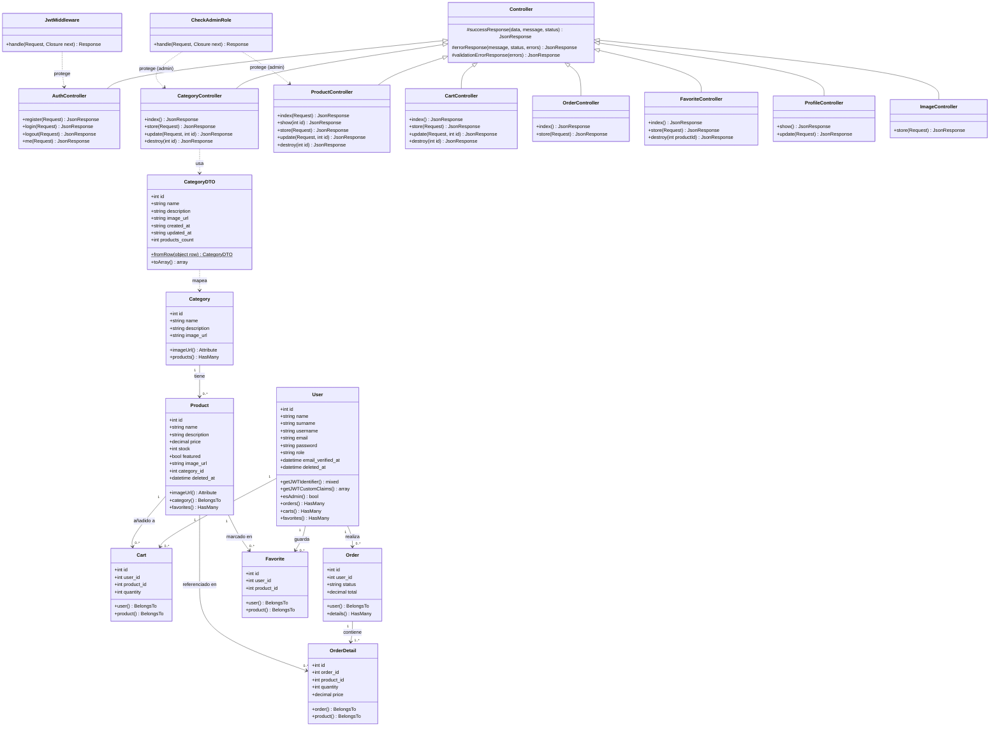

# GeekZone — Diagrama UML de Clases

> Renderizable en: GitHub, VS Code (extensión Mermaid), [mermaid.live](https://mermaid.live)

## Descripción de capas

### Modelos (`app/Models`)
Representan las entidades de la base de datos usando Eloquent ORM. `User` implementa `JWTSubject` para la autenticación stateless. `Product` y `User` usan `SoftDeletes` (campo `deleted_at`).

### DTO (`app/DTOs`)
`CategoryDTO` mapea los resultados crudos de `DB::select()` (stdClass) a un objeto PHP tipado. El `CategoryController` usa SQL puro en lugar de Eloquent, por lo que el DTO actúa como capa de transformación.

### Controladores API (`app/Http/Controllers/Api`)
Todos extienden `Controller` base que centraliza los helpers de respuesta JSON (`successResponse`, `errorResponse`, `validationErrorResponse`).

### Middleware (`app/Http/Middleware`)
- `JwtMiddleware`: valida el token JWT en cada request protegido.
- `CheckAdminRole`: verifica que el usuario autenticado tenga `role = admin`.
