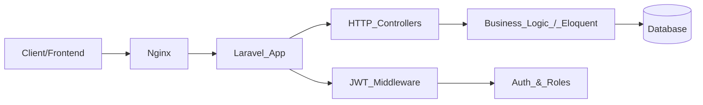

## Documentación funcional y roadmap de `geekzone-ecommerce`

### 1. Visión general del proyecto

GeekZone es un **e‑commerce de productos geek** centrado en temáticas como **Marvel**, **Stray Kids** y **Fútbol**.

Es un proyecto intermodular de **2º DAW (IES Villa de Agüimes, curso 2025/2026)**, desarrollado por el equipo **Izan, Saúl y Marisa**.

La versión actual del proyecto se centra en un **backend robusto en Laravel** que expone una **API REST JSON** para:

- **Autenticación y gestión de usuarios**
- **Catálogo de productos y categorías**
- **Carrito de compra**
- **Gestión de pedidos**
- **Panel de administración** con métricas básicas

El frontend definitivo aún está pendiente de implementación; por ahora existe solo una vista básica de bienvenida y los recursos de la API se validan principalmente mediante tests automáticos y colecciones para herramientas tipo Postman/Bruno.

---

### 2. Stack tecnológico actual

- **Backend**: Laravel (PHP 8.2), carpeta principal `[geekzone/](../geekzone/)`
- **Base de datos**: MySQL 8.0 (a través de Docker)
- **Autenticación**: JWT con el paquete `php-open-source-saver/jwt-auth`
- **Servidor web**: Nginx (reverse proxy hacia PHP-FPM)
- **Contenedores**: Docker + Docker Compose
- **Tests**: PHPUnit / `php artisan test` (tests de Feature y Unit)
- **Pruebas de API**: Colecciones en `[geekzone_api_test/](../geekzone_api_test/)`

---

### 3. Arquitectura de alto nivel

La arquitectura del proyecto se puede resumir en los siguientes bloques:

- **Cliente/Frontend (futuro)**: Aplicación web que consumirá la API REST.
- **Nginx**: Servidor frontal que recibe las peticiones HTTP y las reenvía al contenedor de la app Laravel.
- **Aplicación Laravel (`geekzone/`)**:
  - Controladores HTTP
  - Middleware de autenticación y autorización
  - Modelos Eloquent y lógica de negocio
  - Rutas API (`routes/api.php`)
  - Tests (`tests/`)
- **Base de datos MySQL**:
  - Tablas para usuarios, categorías, productos, carritos, pedidos y detalles de pedido.
- **Colecciones de pruebas de API**:
  - Archivos YAML en `geekzone_api_test/` para validar y documentar el comportamiento de los endpoints.

Diagrama simplificado del flujo de una petición:



---

### 4. Organización del backend Laravel

El backend vive en la carpeta `[geekzone/](../geekzone/)` y sigue la estructura estándar de Laravel, con algunas piezas clave:

- `app/Models/`
  - `User` — Usuarios registrados, con soporte de roles (por ejemplo, admin/cliente).
  - `Product` — Productos del catálogo.
  - `Category` — Categorías de productos (Marvel, Stray Kids, Fútbol, etc.).
  - `Cart` — Carrito de compra de cada usuario.
  - `Order` — Pedido realizado por un usuario.
  - `OrderDetail` — Detalle línea a línea de los productos de un pedido.

- `app/Http/Controllers/`
  - `AuthController` — Registro, login, logout, gestión de tokens JWT.
  - `ProfileController` — Visualización y actualización del perfil del usuario autenticado.
  - `ProductController` — Listado, detalle y gestión de productos.
  - `CategoryController` — Listado y gestión de categorías.
  - `CartController` — CRUD del carrito (añadir, actualizar, eliminar ítems, ver carrito).
  - `OrderController` — Creación de pedidos y consulta de pedidos del usuario.
  - `ImageController` — Subida de imágenes de productos (peticiones `multipart/form-data`).
  - `AdminDashboardController` — Endpoints de analítica y panel de administración.

- `app/Http/Middleware/`
  - `JwtMiddleware` — Verifica que exista y sea válido el token JWT en las peticiones protegidas.
  - `CheckAdminRole` (referenciado como `admin` en rutas) — Restringe ciertas rutas al rol de administrador.

- `routes/api.php`
  - Define todos los endpoints de la API REST, agrupados en:
    - Rutas **públicas**
    - Rutas **protegidas por JWT** (cualquier usuario autenticado)
    - Rutas **de administración** (JWT + rol admin)

- `database/migrations/`
  - Migraciones para crear las tablas necesarias (usuarios, categorías, productos, carritos, pedidos, etc.).

- `database/seeders/`
  - `DatabaseSeeder` ejecuta:
    - `CategorySeeder`
    - `ProductSeeder`
    - `UserSeeder`
  - Permiten poblar la base de datos con categorías, productos y usuarios de prueba.

- `tests/`
  - Carpeta de tests automatizados (ver sección 7).

- `resources/views/welcome.blade.php`
  - Vista de bienvenida básica (no hay todavía un frontend completo).

Infraestructura:

- `docker-compose.yml` — Orquesta los contenedores de la app PHP, la base de datos, Nginx y phpMyAdmin.
- `Dockerfile` — Imagen personalizada para Laravel/PHP.
- `nginx/default.conf` — Configuración de Nginx (virtual host, proxy hacia PHP-FPM, etc.).

---

### 5. Módulos funcionales del backend

Esta sección describe los grandes bloques funcionales del sistema, qué problema resuelven y cómo se relacionan con la API.

#### 5.1 Autenticación y usuarios

- **Controladores implicados**: `AuthController`, `ProfileController`
- **Modelo principal**: `User`
- **Qué resuelve**:
  - Registro de nuevos usuarios.
  - Inicio de sesión con emisión de token JWT.
  - Cierre de sesión (invalida el token).
  - Consulta y actualización del perfil del usuario autenticado.
- **Endpoints principales (ejemplos)**:
  - `POST /api/register` — Registro.
  - `POST /api/login` — Login, devuelve token JWT.
  - `POST /api/logout` — Logout (requiere JWT).
  - `GET /api/perfil` — Ver perfil (JWT).
  - `PUT /api/perfil` — Actualizar perfil (JWT).
- **Seguridad**:
  - Endpoints de registro/login son públicos.
  - Resto de endpoints requieren JWT válido (middleware `JwtMiddleware`).

#### 5.2 Catálogo de productos y categorías

- **Controladores implicados**: `ProductController`, `CategoryController`
- **Modelos principales**: `Product`, `Category`
- **Qué resuelve**:
  - Permite a cualquier usuario listar y consultar el detalle de productos.
  - Organiza los productos en categorías.
- **Endpoints principales (ejemplos)**:
  - `GET /api/categorias` — Listado de categorías (público).
  - `GET /api/productos` — Listado de productos (público).
  - `GET /api/productos/{id}` — Detalle de producto (público).
- **Seguridad**:
  - Lectura del catálogo es **pública**.
  - Operaciones de creación/edición/borrado de categorías y productos son **solo admin** (ver 5.6).

#### 5.3 Carrito de compra

- **Controlador implicado**: `CartController`
- **Modelo principal**: `Cart`
- **Qué resuelve**:
  - Gestión del carrito de compra de cada usuario autenticado.
  - Añadir, modificar o eliminar productos del carrito.
  - Consultar el estado actual del carrito.
- **Endpoints principales (ejemplos)**:
  - `GET /api/carrito` — Obtener el carrito del usuario.
  - `POST /api/carrito` — Añadir producto(s) al carrito.
  - `PUT /api/carrito/{id}` — Actualizar ítem del carrito.
  - `DELETE /api/carrito/{id}` — Eliminar ítem del carrito.
- **Seguridad**:
  - Todos estos endpoints requieren **JWT** (`JwtMiddleware`).

#### 5.4 Pedidos

- **Controlador implicado**: `OrderController`
- **Modelos principales**: `Order`, `OrderDetail`
- **Qué resuelve**:
  - Conversión del carrito en pedido confirmado.
  - Registro histórico de pedidos por usuario.
- **Endpoints principales (ejemplos)**:
  - `GET /api/pedidos` — Listar pedidos del usuario.
  - `POST /api/pedidos` — Crear un nuevo pedido a partir del carrito.
- **Seguridad**:
  - Requiere **JWT** (solo usuarios autenticados pueden crear y ver sus pedidos).

#### 5.5 Gestión de imágenes

- **Controlador implicado**: `ImageController`
- **Qué resuelve**:
  - Subida y almacenamiento de imágenes de productos.
- **Endpoints principales (ejemplo)**:
  - `POST /api/imagenes` — Sube una imagen (petición `multipart/form-data`).
- **Seguridad**:
  - Endpoint protegido con **JWT**.
  - En función de la configuración, se puede restringir su uso a roles concretos (por ejemplo admin).

#### 5.6 Administración y analítica

- **Controlador implicado**: `AdminDashboardController`
- **Otros controladores reutilizados**: `ProductController`, `CategoryController`
- **Qué resuelve**:
  - Permite a los administradores consultar métricas básicas del negocio.
  - Provee endpoints de administración para gestionar catálogo y categorías.
- **Endpoints principales (ejemplos)**:
  - `GET /api/admin/dashboard/resumen`
  - `GET /api/admin/dashboard/ingresos`
  - `GET /api/admin/dashboard/top-productos`
  - `GET /api/admin/dashboard/pedidos-por-cliente`
  - `POST/PUT/DELETE /api/productos` — Crear/editar/eliminar productos.
  - `POST/PUT/DELETE /api/categorias` — Crear/editar/eliminar categorías.
- **Seguridad**:
  - Todas estas rutas están dentro del grupo protegido por:
    - `JwtMiddleware`
    - Middleware `admin` (que comprueba el rol de administrador).

---

### 6. Endpoints y niveles de acceso

A alto nivel, la API se puede agrupar así (coincide con lo descrito en `routes/api.php` y el `README.md`):

- **Públicos**:
  - `POST /api/register`
  - `POST /api/login`
  - `GET /api/categorias`
  - `GET /api/productos`
  - `GET /api/productos/{id}`

- **Protegidos (requieren JWT)**:
  - `POST /api/logout`
  - `GET /api/perfil`
  - `PUT /api/perfil`
  - `GET /api/carrito`
  - `POST /api/carrito`
  - `PUT /api/carrito/{id}`
  - `DELETE /api/carrito/{id}`
  - `GET /api/pedidos`
  - `POST /api/pedidos`
  - `POST /api/imagenes`

- **Administración (JWT + rol admin)**:
  - `GET /api/admin/dashboard/resumen`
  - `GET /api/admin/dashboard/ingresos`
  - `GET /api/admin/dashboard/top-productos`
  - `GET /api/admin/dashboard/pedidos-por-cliente`
  - `POST /api/categorias`
  - `PUT /api/categorias/{id}`
  - `DELETE /api/categorias/{id}`
  - `POST /api/productos`
  - `PUT /api/productos/{id}`
  - `DELETE /api/productos/{id}`

Esquema de autenticación y roles:

- La autenticación se realiza mediante **JWT**:
  - El usuario se registra o inicia sesión.
  - El backend devuelve un token JWT.
  - El cliente incluye el token en las peticiones protegidas (típicamente en la cabecera `Authorization: Bearer <token>`).
- El middleware `JwtMiddleware` valida:
  - Firma y validez del token.
  - Usuario asociado.
- El middleware `admin` comprueba:
  - Que el usuario autenticado tiene el rol de **administrador** antes de permitir el acceso a rutas críticas (dashboard, CRUD de catálogo, etc.).

---

### 7. Entorno, despliegue y datos de ejemplo

#### 7.1 Entorno y despliegue con Docker

El proyecto está preparado para ejecutarse completamente en contenedores Docker mediante `docker-compose`.

Pasos típicos (resumen, ver más detalle en el `README.md` de la raíz):

```bash
# 1. Clonar el repositorio
git clone <url-del-repositorio>
cd geekzone-ecommerce

# 2. Configurar variables de entorno (según .env.example)
# 3. Levantar los contenedores
docker-compose up -d --build

# 4. Instalar dependencias de PHP
docker-compose exec app composer install

# 5. Generar clave de la aplicación
docker-compose exec app php artisan key:generate

# 6. Generar clave secreta para JWT
docker-compose exec app php artisan jwt:secret

# 7. Ejecutar migraciones y seeders
docker-compose exec app php artisan migrate
docker-compose exec app php artisan db:seed
```

Servicios principales y URLs:

- Aplicación web Laravel / API: `http://localhost:8080`
- phpMyAdmin: `http://localhost:8081`
- Documentación Swagger (cuando esté completada): `http://localhost:8080/api/documentation`

#### 7.2 Datos de prueba (seeders)

Los seeders definidos en `database/seeders` inicializan:

- **Categorías** (por ejemplo, Marvel, Stray Kids, Fútbol, etc.).
- **Productos** de ejemplo asociados a dichas categorías.
- **Usuarios** de prueba (al menos un admin y un usuario cliente).

Ejemplo de usuarios documentados:

- **Admin**:
  - Email: `admin@geekzone.com`
  - Contraseña: `admin123`
- **Cliente**:
  - Email: `user@geekzone.com`
  - Contraseña: `user123`

Estos usuarios son útiles para probar tanto el flujo de cliente como el de administración.

---

### 8. Estrategia de calidad: tests y pruebas de API

#### 8.1 Tests automáticos

El proyecto incluye tests automáticos basados en **PHPUnit** y la infraestructura de testing de Laravel.

- Configuración principal: `geekzone/phpunit.xml`
  - Define dos test suites:
    - `tests/Unit`
    - `tests/Feature`
  - Incluye el directorio `app` como fuente analizada.
  - Configura el entorno de test con:
    - `DB_CONNECTION=sqlite`
    - `DB_DATABASE=:memory:` (base de datos en memoria)
    - Otras variables (`CACHE_STORE`, `QUEUE_CONNECTION`, etc.) para aislar el entorno.

- Ejecución de tests:

```bash
# Desde la raíz del proyecto, dentro del contenedor app
docker-compose exec app php artisan test --testdox

# O desde la carpeta geekzone/ (si se ejecuta directamente en entorno local)
composer test
```

Los tests de **Feature** cubren flujos completos de la API, como:

- Registro e inicio de sesión.
- Operaciones de catálogo.
- Gestión de carrito.
- Creación y consulta de pedidos.
- Endpoints de administración.

Los tests de **Unit** validan piezas más aisladas de la lógica.

#### 8.2 Pruebas manuales de API

Además de los tests automatizados, existen recursos para hacer pruebas manuales:

- Carpeta `[geekzone_api_test/](../geekzone_api_test/)`:
  - Contiene colecciones en formato YAML adecuadas para herramientas como **Bruno**, **Thunder Client**, **Postman** (previa conversión), etc.
  - Estas colecciones incluyen ejemplos de peticiones para:
    - Autenticación (registro, login, logout).
    - Endpoints de catálogo (productos, categorías).
    - Operaciones de carrito y pedidos.
    - Endpoints de administración.

Esto permite validar rápidamente la API sin necesidad de construir todavía el frontend definitivo.

---

### 9. Roadmap inmediato: Frontend

Actualmente, el proyecto solo dispone de una vista básica (`welcome.blade.php`) y de la parte pública mínima en `public/`. El siguiente gran bloque de trabajo consiste en construir un **frontend completo** que consuma la API existente.

#### 9.1 Objetivos del frontend

- Proveer una **experiencia de compra completa** para el usuario final.
- Aprovechar todos los módulos del backend ya desarrollados (auth, catálogo, carrito, pedidos, admin).
- Mantener una **separación clara** entre frontend y backend mediante una API REST JSON.

#### 9.2 Áreas funcionales a implementar

- **Área pública**:
  - Página de inicio con destacados.
  - Listado de productos con filtros básicos (por categoría, búsqueda simple).
  - Página de detalle de producto (descripción, precio, imágenes, stock).
  - Registro de usuario.
  - Inicio de sesión.

- **Área de usuario autenticado**:
  - Gestión de carrito de compra:
    - Añadir productos desde el catálogo/detalle.
    - Ver y actualizar cantidades en el carrito.
    - Eliminar productos del carrito.
  - Flujo de checkout:
    - Confirmación del pedido a partir del carrito.
    - Resumen del pedido antes de finalizar.
  - Historial de pedidos:
    - Listado de pedidos anteriores.
    - Detalle de cada pedido.
  - Gestión de perfil:
    - Ver y editar la información de usuario.

- **Área de administración**:
  - Panel/dashboards:
    - Resumen de métricas clave (ingresos, número de pedidos, productos más vendidos, etc.).
  - Gestión de catálogo:
    - CRUD de productos (crear, editar, borrar).
    - CRUD de categorías.
  - Listado de pedidos por cliente.

#### 9.3 Interacción con la API

Independientemente de la tecnología concreta elegida para el frontend (por ejemplo, **React**, **Vue**, **Blade mejorado** u otro framework SPA), la interacción seguirá este patrón:

- Consumir endpoints **públicos** (catálogo, detalle de producto, registro, login) sin token.
- Al iniciar sesión:
  - Guardar el **token JWT** devuelto por el backend.
  - Incluirlo en las peticiones protegidas mediante la cabecera `Authorization: Bearer <token>`.
- Consumir endpoints **protegidos** para:
  - Gestionar el carrito y los pedidos.
  - Mostrar y actualizar el perfil.
- Para la parte de **administración**:
  - Mostrar funcionalidades adicionales cuando el usuario logado tenga rol admin (según la información del token o un endpoint de perfil).
  - Consumir los endpoints del dashboard y de gestión de catálogo.

Un posible esquema de las interacciones futuras:

```mermaid
flowchart LR
  fe[Frontend_App] -->|HTTP_JSON| api[Laravel_API]
  api -->|JWT_validación| authLayer[Auth_&_Middleware]
  api --> catalog[Catalogo_(Productos/Categorias)]
  api --> cart[Carrito]
  api --> orders[Pedidos]
  api --> adminDash[Admin_Dashboard]
  adminDash --> db[(Database)]
  catalog --> db
  cart --> db
  orders --> db
```

---

### 10. Roadmap inmediato: Documentación Swagger / OpenAPI

Aunque la API ya está bien estructurada y cubierta por tests y colecciones de prueba, el siguiente paso importante es disponer de **documentación Swagger/OpenAPI** centralizada y navegable.

#### 10.1 Situación actual

- La API se prueba mediante:
  - Tests automatizados (`geekzone/tests`).
  - Colecciones YAML en `geekzone_api_test/`.
- En el `README.md` ya se reserva una URL para la documentación de la API:
  - `http://localhost:8080/api/documentation`
- Sin embargo, aún falta completar la generación y mantenimiento sistemático de un documento **OpenAPI 3**.

#### 10.2 Objetivos de la documentación Swagger

- Disponer de un **documento OpenAPI 3** que describa:
  - Todos los endpoints de la API.
  - Parámetros de entrada (query, path, body).
  - Modelos de datos de entrada y salida.
  - Códigos de estado y posibles errores.
- Exponer una **UI de Swagger** accesible (por ejemplo, en `/api/documentation`) para:
  - Desarrolladores backend y frontend.
  - Equipo de QA.
  - Profesores o revisores del proyecto.

#### 10.3 Estrategia técnica propuesta (a alto nivel)

- **Paso 1 — Elegir herramienta de integración**:
  - Evaluar un paquete de Laravel que permita generar documentación OpenAPI a partir de:
    - Anotaciones PHPDoc en los controladores.
    - O bien configuración basada en YAML/JSON.

- **Paso 2 — Anotar/controlar los endpoints**:
  - Para cada módulo (auth, catálogo, carrito, pedidos, admin), documentar:
    - Ruta (método HTTP + URL).
    - Descripción funcional.
    - Parámetros.
    - Códigos de respuesta.
    - Esquemas de modelos usados.

- **Paso 3 — Exponer la documentación**:
  - Servir la UI de Swagger en la ruta ya reservada:
    - `/api/documentation`
  - Asegurar que la especificación se mantiene sincronizada con las rutas de `routes/api.php` y con las colecciones de `geekzone_api_test/`.

- **Paso 4 — Integrar en el flujo de desarrollo**:
  - Establecer la regla de que:
    - Cada vez que se añada o modifique un endpoint relevante, se actualice:
      - El documento OpenAPI.
      - Opcionalmente, las colecciones de prueba de API.

---

### 11. Mantenimiento de la documentación y mejoras futuras

#### 11.1 Mantenimiento de este documento

Para que este documento siga siendo útil, se recomienda:

- **Actualizarlo** cada vez que:
  - Se añada un nuevo módulo funcional.
  - Se modifiquen endpoints importantes.
  - Cambie la arquitectura (por ejemplo, introducción de nuevas colas, cachés, microservicios, etc.).
- Incluir la actualización de la documentación como parte de la **definición de terminado** de cada tarea o Pull Request relevante.

#### 11.2 Posibles mejoras futuras (más allá del roadmap inmediato)

- Añadir **paginación y filtros avanzados** en el catálogo.
- Implementar un sistema de **cupones y descuentos**.
- Enviar **notificaciones por email** al crear o actualizar pedidos.
- Mejorar la **observabilidad**:
  - Logs estructurados.
  - Métricas e integración con herramientas de monitorización.
- Implementar **mejoras de rendimiento**:
  - Caché para listados de productos muy accedidos.
  - Optimización de consultas en endpoints de dashboard.

